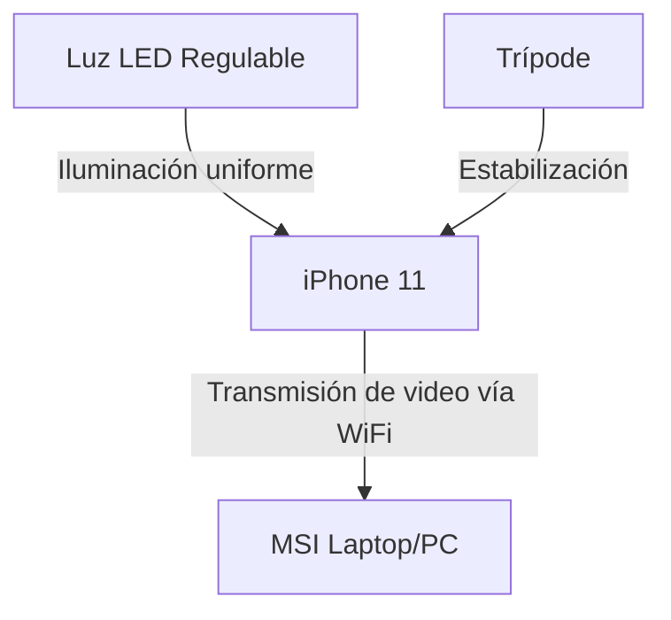
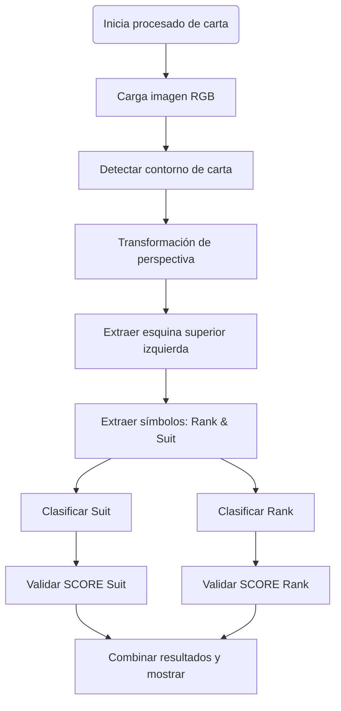
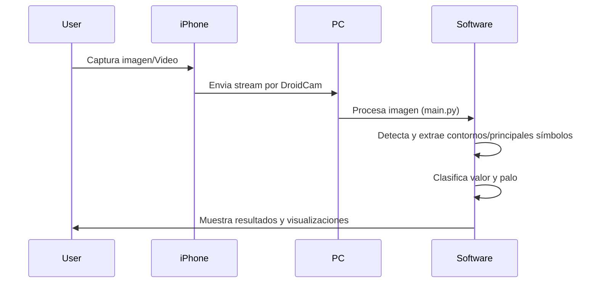

# ProyectoIA: Sistema de Reconocimiento de Cartas – Documentación Técnica

## Índice

1. [Resumen](#resumen)
2. [Estructura del Proyecto](#estructura)
3. [Hardware](#hardware)
    - [Requisitos y justificación](#requisitos-hardware)
    - [Especificaciones técnicas](#especificaciones-hardware)
    - [Diagrama del montaje](#diagrama-montaje)
4. [Software](#software)
    - [Requisitos y justificación](#requisitos-software)
    - [Especificaciones técnicas](#especificaciones-software)
5. [Hoja de Ruta de Desarrollo](#hoja-de-ruta)
6. [Solución](#solucion)
    - [Diagrama de Decisión](#diagrama-decision)
    - [Secuencialización de Operaciones](#secuencializacion)
    - [Explicación de las funcionalidades principales](#funcionalidades)
7. [Otras Tareas Realizadas](#otras-tareas)

---

<a name="estructura"></a>
## 2. Estructura del Proyecto

```
DetectorCartas/
│
├── main.py                      # Script principal - punto de entrada
├── live_detector.py             # Detector en tiempo real con interfaz visual
├── requirements.txt             # Dependencias del proyecto
├── README.md                    # Este archivo
├── .gitignore                   # Archivos ignorados por git
│
├── modules/                     # Módulos principales del sistema
│   ├── __init__.py             # Inicialización del paquete
│   ├── card_detection.py       # Detección y extracción de cartas
│   ├── image_processing.py     # Procesamiento básico de imágenes
│   ├── symbol_extraction.py    # Extracción de símbolos de esquinas
│   ├── rank_classifier.py      # Clasificación de números/letras
│   ├── suit_classifier.py      # Clasificación de palos
│   ├── suit_features.py        # Características específicas por palo
│   ├── template_builder.py     # Construcción de plantillas
│   └── visualization.py        # Funciones de visualización
│
├── template/                    # Directorio de plantillas (gitignored)
│   ├── corazones/              # Plantillas de corazones
│   ├── diamantes/              # Plantillas de diamantes
│   ├── picas/                  # Plantillas de picas
│   └── treboles/               # Plantillas de tréboles
│
├── content/                     # Imágenes de prueba (gitignored)
│   └── *.jpg                   # Imágenes de cartas para procesamiento
│
├── captures/                    # Capturas del detector en vivo
│   └── *.jpg                   # Imágenes capturadas durante detección
└── __pycache__/                # Cache de Python (gitignored)
│
└── venv/                       # Entorno virtual con dependencias instaladas localmente 
```

---

<a name="resumen"></a>
## 1. Resumen

Sistema modular para el reconocimiento automático de cartas de baraja española/inglesa a través de visión por computadora. Capaz de procesar imágenes estáticas y video en tiempo real utilizando plantillas optimizadas y extracción robusta de características.

---

<a name="hardware"></a>
## 2. Hardware

<a name="requisitos-hardware"></a>
### Requisitos y Justificación

| Componente            | Justificación |
|-----------------------|--------------|
| **iPhone 11**         | Cámara de alta calidad para captura precisa de cartas, movilidad y fácil integración con software de cámara web. |
| **MSI Laptop/PC**     | Procesamiento rápido de imágenes y ejecución confiable de algoritmos en Python/OpenCV. |
| **Luz LED Regulable** | Iluminación uniforme, minimiza sombras y reflejos, importante para la binarización óptima de imágenes. |
| **Trípode**           | Estabilidad en la toma de imágenes y videos, reduce errores por movimiento en el flujo en vivo. |

<a name="especificaciones-hardware"></a>
### Especificaciones Técnicas

**iPhone 11 – Especificaciones de la cámara**
- Sensor principal: 12 MP, f/1.8, 26mm (wide), PDAF, OIS
- Video: Hasta 4K@60fps
- Resolución testada: 1280x720 a 30fps (para transmisión en vivo)
- Comunicación: Utilizando la app DroidCam Wireless Webcam

**MSI Laptop/PC de desarrollo**
- Procesador: Intel Core i7, 6 núcleos @ >2.6GHz
- RAM: ≥16GB
- GPU: NVIDIA GTX/RTX (opcional, para acelerar procesamiento)
- Almacenamiento: SSD recomendado

**Montaje Típico del Sistema**



---

<a name="software"></a>
## 3. Software

<a name="requisitos-software"></a>
### Requisitos y Justificación

| Componente            | Justificación |
|-----------------------|--------------|
| **Python ≥3.8**       | Lenguaje principal, soporta todas las librerías necesarias, fácil desarrollo, fuerte comunidad. |
| **OpenCV**            | Procesamiento eficiente de imágenes, binarización, transformaciones geométricas. |
| **Numpy/Scipy**       | Cálculos de matrices, estadísticas, operaciones matemáticas avanzadas. |
| **Matplotlib**        | Visualización de resultados, debugging gráfico. |
| **DroidCam**          | Transmisión de señal de video desde smartphone a PC. |

<a name="especificaciones-software"></a>
### Especificaciones Técnicas

| Lenguaje/Librería        | Versión Recomendada | Uso Principal              |
|-------------------------|---------------------|-----------------------------|
| Python                  | 3.8+                | Backend, lógica, scripts    |
| OpenCV (`cv2`)          | 4.5+                | Procesado de imágenes       |
| Numpy                   | 1.20+               | Operaciones matriciales     |
| Scipy                   | 1.6+                | Filtros y funciones métricas|
| Matplotlib              | 3.3+                | Visualización               |
| DroidCam App            | Última              | Transmisión Video           |

---

<a name="hoja-de-ruta"></a>
## 4. Hoja de Ruta del Desarrollo

1. **Definición del problema**: Procesamiento y reconocimiento de cartas usando visión artificial.
2. **Selección y prueba de hardware/software**: Verificación de calidad de capturas, conectividad y fiabilidad.
3. **Diseño modular**:
   - Separación clara por funciones: `card_detection`, `symbol_extraction`, `rank_classifier`, `suit_classifier`, etc.
   - Documentado y flexible para pruebas.
4. **Implementación de procesamiento de imágenes**:
   - Algoritmos robustos de binarización y detección de contornos.
   - Transformación de perspectiva orientada verticalmente.
5. **Desarrollo y ajuste de extractores de símbolos**:
   - Funciones para separar y limpiar los símbolos de la esquina.
   - Algoritmos para diferentes condiciones de luz y escala.
6. **Creación de plantillas de símbolos**:
   - Generación y promediado de prototipos RGB/LAB/HSV para cada palo.
7. **Desarrollo de clasificadores**:
   - Clasificador robusto de `rank` y `suit` usando combinaciones de correlación, Chamfer, SSIM, análisis de color y forma.
8. **Construcción de la interfaz en vivo**:
   - Detector en tiempo real con estabilización por historial para minimizar errores.
9. **Pruebas exhaustivas y ajustes finos**
   - Integración del procesamiento interactivo y automático.
10. **Documentación y visualización**
    - Generación de gráficos, tablas explicativas, diagramas de decisión.

---

<a name="solucion"></a>
## 5. Solución

<a name="diagrama-decision"></a>
### Diagrama de Decisión – Clasificación de Cartas



---

<a name="secuencializacion"></a>
### Secuencialización de Operaciones

La siguiente tabla resume el flujo de procesamiento para una imagen de carta:

| Paso | Función Principal | Parámetros Clave | Propósito & Justificación |
|------|---------------------------|-------------------------|-------------------------|
| 1    | `load_image_rgb`          | path                   | Carga robusta en RGB, necesario para tratamiento uniforme. |
| 2    | `find_card_contour_from_binary` | min_area=10000        | Asegura detección solo de objetos grandes (cartas). |
| 3    | `four_point_transform`    | width=300, height=420  | Ajusta perspectiva y dimensiones, normaliza tamaños. |
| 4    | `extract_top_left_corner` | w_ratio=0.28, h_ratio=0.40 | Ratio ajustable según tamaño de ROI en carta. |
| 5    | `extract_symbols_from_corner` | min_area=50, horizontal_gap=20 | Parámetros adaptativos para separar símbolos. |
| 6    | `enhanced_rank_classification` | rank_templates        | Algoritmo de matching multicanal y validaciones heurísticas. |
| 7    | `classify_suit_v7`        | suit_templates, suit_color_prototypes | Aprovecha análisis de color + forma para decisión robusta. |
| 8    | Resultados y visualización | - | Validación de scores y despliegue de resultados. |

#### Ilustración de secuencia típica:



---

<a name="funcionalidades"></a>
### Explicación y Configuración de Funciones Clave

#### 1. Extracción y procesamiento de contornos

```python
def find_card_contour_from_binary(binary, min_area=10000):
    # Detecta contornos grandes (cartas)
    # min_area: evita falsos positivos por ruido/luz
```
> **Justificación:** Se emplea un área mínima alta debido al alto contraste y tamaño relativo de las cartas en las capturas.

#### 2. Transformación de perspectiva

```python
def four_point_transform(image_rgb, pts, width=300, height=420):
    # Corrige inclinación/distorsión, asegura orientación vertical
    # width/height: homogeneidad en tamaño, útil para normalizar el matching de símbolos.
```

#### 3. Extracción de ROI (esquina superior)

```python
def extract_top_left_corner(warped_card, w_ratio=0.28, h_ratio=0.40):
    # Captura la región donde suelen estar los símbolos
    # w_ratio/h_ratio: balance entre incluir todo el símbolo y evitar bordes no relevantes.
```

#### 4. Segmentación y limpieza de símbolos

```python
def extract_symbols_from_corner(corner_rgb, min_area=50, horizontal_gap=20):
    # Thresholds adaptativos y morfología para separar símbolos superpuestos.
    # horizontal_gap: da tolerancia para unir símbolos adyacentes (ejemplo: "10").
```

#### 5. Clasificador de rank

```python
def enhanced_rank_classification(rank_symbol, rank_templates):
    # Matching multidimensional (correlación, edge, SSIM, Chamfer, etc.)
    # Validaciones extra para símbolos ambiguos ("8"/"5"/"6")
    # Escalado y normalización inteligente
```

#### 6. Clasificador de palo

```python
def classify_suit_v7(suit_symbol_binary, corner_rgb, suit_templates, suit_color_prototypes):
    # Matching de forma + color + heurísticas
    # Detecta degeneraciones y aplica correcciones morfológicas
    # Utiliza estadísticas de color para distinguir entre palos similares
```

---

<a name="otras-tareas"></a>
## 6. Otras Tareas Realizadas

- **Desarrollo de script para reconocimiento en vivo** (live_detector.py)
    - Interfaz visual minimalista, estabilización de resultados por buffer/history.
- **Generación automática de plantillas** para ranks y suits (template_builder.py).
- **Visualización multicapa**: despliegue de imágenes originales, transformadas y resultados segmentados.
- **Ajuste de parámetros y testing** en condiciones variables de luz (gracias a LED regulable).
- **Automatización de batch processing**: función para procesar directorios completos y guardar resultados en CSV.
- **Gestión y pre-procesado de datasets** propios, creación de plantillas adaptadas a la baraja utilizada.
- **Documentación interna y comentarios explicativos** en el código para facilitar la extensibilidad y pruebas por otros usuarios.
- **Pruebas de clasificación bajo diferentes ángulos, distancias y luces**; implementación de tolerancias/adaptaciones para robustez.


---

## Tablas comparativas de resultados (ejemplo ilustrativo)

| Imagen | Rank Detectado | Palo Detectado | Score Rank | Score Palo | Estado  |
|--------|---------------|---------------|------------|------------|---------|
| carta_1.png | 8           | Corazones     | 0.74       | 0.88       | Ok      |
| carta_2.png | 5           | Treboles      | 0.76       | 0.79       | Ok      |
| ...    | ...           | ...           | ...        | ...        | ...     |

---

## Conclusión

El sistema logra un procesado robusto y flexible con adaptación a diferentes montajes físicos y variabilidad de condiciones lumínicas. La modularización facilita el ajuste y la extensión futura del pipeline.

---

**Autor:** Diego Jiménez  
**Repo:** [diegojiimenez/ProyectoIA](https://github.com/diegojiimenez/ProyectoIA)
